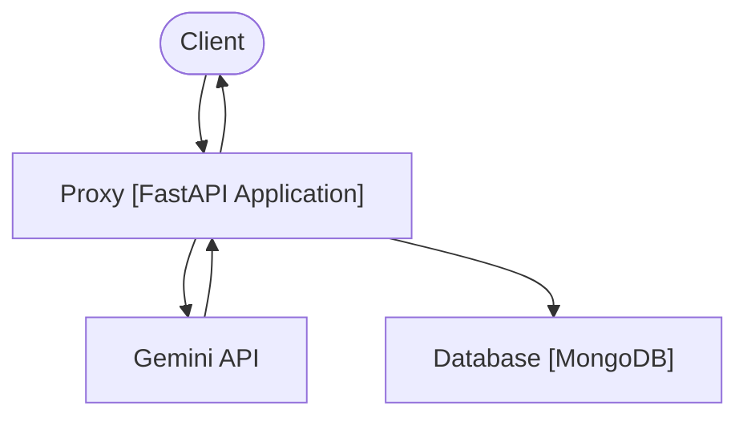

# Gemini API Caching Proxy

This project implements a local proxy for the Gemini API. It intercepts requests from clients, logs them to a MongoDB database, and forwards the responses back to the client. This is particularly useful for applications like VS Code extensions that interact with the Gemini API, allowing for logging and analysis of API interactions.

## Features

*   **Request and Response Logging:** Logs full request and response data, including headers, body, status codes, and timing.
*   **Streaming Support:** Handles and logs streaming responses from the Gemini API.
*   **MongoDB Storage:** Stores logged data in a MongoDB database, capable of handling large volumes of data.
*   **Dockerized:** Easy to set up and run locally using Docker and Docker Compose.
*   **Extensible:** Designed to potentially support other AI service providers in the future.

## Architecture

The proxy follows a simple proxy pattern:


The main components are:

*   **FastAPI Application:** The core proxy logic, handling request interception, forwarding, and response logging.
*   **HTTP Client:** Used for forwarding requests to the Gemini API.
*   **MongoDB Client:** Used for interacting with the MongoDB database.
*   **Docker Containers:** The FastAPI application and MongoDB are run as separate Docker containers managed by Docker Compose.

## Setup and Installation

1.  **Clone the repository:**
    ```bash
    git clone git@github.com:raslab/gemini_caching_proxy.git
    cd gemini_caching_proxy
    ```

2.  **Set up environment variables:**
    Copy the `.env.example` file to `.env` and update the `GEMINI_API_KEY` with your actual Gemini API key.
    ```bash
    cp .env.example .env
    ```
    Edit the `.env` file:
    ```
    GEMINI_API_KEY=YOUR_GEMINI_API_KEY
    ```

3.  **Run with Docker Compose:**
    Build and run the Docker containers using Docker Compose.
    ```bash
    docker-compose up --build -d
    ```
    This will start the FastAPI proxy application and the MongoDB database in detached mode.

## Usage

Once the Docker containers are running, configure your client application (e.g., VS Code extension) to send requests to the proxy's address and port (default is `http://localhost:8000`). The proxy will then handle the forwarding and logging.

## Database

The logged data is stored in a MongoDB database. The database data is persisted using a Docker volume. You can connect to the MongoDB container to view or analyze the logged interactions in the `gemini_interactions` collection.

Example of a logged interaction schema inside mongoDB:
```json
{
  "_id": {
    "$oid": "681bcc43e6b95976451c3865"
  },
  "timestamp": {
    "$date": "2025-05-07T21:10:23.517Z"
  },
  "request": {
    "timestamp": {
      "$date": "2025-05-07T21:10:23.517Z"
    },
    "method": "POST",
    "path": "/v1beta/models/gemini-2.5-flash-preview-04-17:streamGenerateContent",
    "headers": {
      "host": "localhost:18001",
      "connection": "keep-alive",
      "user-agent": "google-genai-sdk/0.9.0 gl-node/v20.18.3",
      "x-goog-api-client": "google-genai-sdk/0.9.0 gl-node/v20.18.3",
      "content-type": "application/json",
      "x-goog-api-key": "KEY_HERE",
      "accept": "*/*",
      "accept-language": "*",
      "sec-fetch-mode": "cors",
      "accept-encoding": "gzip, deflate",
      "content-length": "57965"
    },
    "body": {
      "contents": [
        {
          "parts": [
            {
              "text": "user_prompt"
            },
            {
              "text": "user_prompt"
            }
          ],
          "role": "user"
        }
      ],
      "systemInstruction": {
        "parts": [
          {
            "text": "custom_instruction"
          }
        ],
        "role": "user"
      },
      "generationConfig": {
        "temperature": 0,
        "thinkingConfig": {
          "thinkingBudget": 0
        }
      }
    }
  },
  "response": {
    "status": 200,
    "headers": {
      "content-type": "text/event-stream",
      "content-disposition": "attachment",
      "vary": "Origin, X-Origin, Referer",
      "transfer-encoding": "chunked",
      "date": "Wed, 07 May 2025 21:10:24 GMT",
      "server": "scaffolding on HTTPServer2",
      "x-xss-protection": "0",
      "x-frame-options": "SAMEORIGIN",
      "x-content-type-options": "nosniff",
      "server-timing": "gfet4t7; dur=907",
      "alt-svc": "h3=\":443\"; ma=2592000,h3-29=\":443\"; ma=2592000"
    },
    "body": "batched_response"
  },
  "request_duration_ms": 4415.0689999999995,
  "generation_settings": {
    "temperature": 0,
    "thinkingConfig": {
      "thinkingBudget": 0
    }
  },
  "usage_metadata": null,
  "error": null
}
```
where `request` contains the original request data, `response` contains the response from the Gemini API. `batched_response` is a string that contains the streamed response data and looks like:
```text
data: {\"candidates\": [{\"content\": {\"parts\": [{\"text\": \"\\u003cthinking\\u003eThe user wants\"}],\"role\": \"model\"},\"index\": 0}],\"usageMetadata\": {\"promptTokenCount\": 13078,\"candidatesTokenCount\": 6,\"totalTokenCount\": 13084,\"promptTokensDetails\": [{\"modality\": \"TEXT\",\"tokenCount\": 13078}]},\"modelVersion\": \"models/gemini-2.5-flash-preview-04-17\"}\r\n\r\ndata: {\"candidates\": [{\"content\": {\"parts\": [{\"text\": \" to connect the current project to a Git repository, add `.env` to the `.gitignore` file, and create a `.env.example` file.\\n\\nSince I am in PLAN MODE, I need to outline the steps I will take to achieve this and\"}],\"role\": \"model\"},\"index\": 0}],\"usageMetadata\": {\"promptTokenCount\": 13078,\"candidatesTokenCount\": 58,\"totalTokenCount\": 13136,\"promptTokensDetails\": [{\"modality\": \"TEXT\",\"tokenCount\": 13078}]},\"modelVersion\": \"models/gemini-2.5-flash-preview-04-17\"}\r\n\r\ndata: {\"candidates\": [{\"content\": {\"parts\": [{\"text\": \" present the plan to the user using the `plan_mode_respond` tool.\\n\\nHere's the plan:\\n1. Initialize a Git repository in the current working directory.\\n2. Add a `.gitignore` file if it doesn't exist,\"}],\"role\": \"model\"},\"index\": 0}],\"usageMetadata\": {\"promptTokenCount\": 13078,\"candidatesTokenCount\": 111,\"totalTokenCount\": 13189,\"promptTokensDetails\": [{\"modality\": \"TEXT\",\"tokenCount\": 13078}]},\"modelVersion\": \"models/gemini-2.5-flash-preview-04-17\"}\r\n\r\n
```
or, in unescaped format:
```text
data: {"candidates": [{"content": {"parts": [{"text": "<thinking>The user wants"}],"role": "model"},"index": 0}],"usageMetadata": {"promptTokenCount": 13078,"candidatesTokenCount": 6,"totalTokenCount": 13084,"promptTokensDetails": [{"modality": "TEXT","tokenCount": 13078}]},"modelVersion": "models/gemini-2.5-flash-preview-04-17"}

data: {"candidates": [{"content": {"parts": [{"text": " to connect the current project to a Git repository, add `.env` to the `.gitignore` file, and create a `.env.example` file.\n\nSince I am in PLAN MODE, I need to outline the steps I will take to achieve this and"}],"role": "model"},"index": 0}],"usageMetadata": {"promptTokenCount": 13078,"candidatesTokenCount": 58,"totalTokenCount": 13136,"promptTokensDetails": [{"modality": "TEXT","tokenCount": 13078}]},"modelVersion": "models/gemini-2.5-flash-preview-04-17"}

data: {"candidates": [{"content": {"parts": [{"text": " present the plan to the user using the `plan_mode_respond` tool.\n\nHere's the plan:\n1. Initialize a Git repository in the current working directory.\n2. Add a `.gitignore` file if it doesn't exist,"}],"role": "model"},"index": 0}],"usageMetadata": {"promptTokenCount": 13078,"candidatesTokenCount": 111,"totalTokenCount": 13189,"promptTokensDetails": [{"modality": "TEXT","tokenCount": 13078}]},"modelVersion": "models/gemini-2.5-flash-preview-04-17"}
...
```

You can use this data for analysis, debugging, or any other purpose. For example, you can count the number of tokens in the requests in all your by running the mongo shell command:
```javascript
db.getCollection("gemini_interactions").aggregate([
    { $match: { "response.body": { $exists: true } } },
    { $project: { "response.body": 1, "timestamp": 1 } },
    {
        $addFields: {
            // put timestamp at the first place
            dateTime: {
                $dateToString: {
                    format: "%Y-%m-%d %H:%M:%S",
                    date: "$timestamp"
                }
            }
        }
    },
    {
        $addFields: {
            response: {
                $convert: {
                    input: "$response.body",
                    to: "string",
                    onError: "Conversion failed",
                    onNull: "No value"
                }
            }
        }
    },
    {
        $addFields: {
            // Split the response string by "\r\n\r\n" and filter out empty strings
            _temp_responseLines: {
                $filter: {
                    input: { $split: ["$response", "\r\n\r\n"] },
                    as: "line",
                    cond: { $ne: ["$$line", ""] }
                }
            }
        }
    },
    {
        $addFields: {
            // Get the last line from the filtered array
            _temp_lastDataLineWithPrefix: {
                $cond: {
                    if: { $gt: [{ $size: "$_temp_responseLines" }, 0] },
                    then: { $last: "$_temp_responseLines" },
                    else: "" // Handle cases where there are no valid lines
                }
            }
        }
    },
    {
        $addFields: {
            // Remove "data: " prefix if it exists
            _temp_jsonDataString: {
                $let: {
                    vars: { line: "$_temp_lastDataLineWithPrefix" },
                    in: {
                        $cond: {
                            if: { $regexMatch: { input: "$$line", regex: "^data: " } },
                            then: { $substrBytes: ["$$line", 6, { $subtract: [{ $strLenBytes: "$$line" }, 6] }] },
                            else: "$$line" // If no "data: " prefix, use the line as is
                        }
                    }
                }
            }
        }
    },
    {
        $addFields: {
            // Use regex to find token count patterns in the JSON string
            _temp_promptTokenMatch: { $regexFind: { input: "$_temp_jsonDataString", regex: "\"promptTokenCount\":\\s*(\\d+)" } },
            _temp_candidatesTokenMatch: { $regexFind: { input: "$_temp_jsonDataString", regex: "\"candidatesTokenCount\":\\s*(\\d+)" } },
            _temp_totalTokenMatch: { $regexFind: { input: "$_temp_jsonDataString", regex: "\"totalTokenCount\":\\s*(\\d+)" } }
        }
    },
    {
        $addFields: {
            // Extract and convert captured token counts to integers
            inputTokens: {
                $cond: {
                    if: { $and: ["$_temp_promptTokenMatch", { $gt: [{ $size: { $ifNull: ["$_temp_promptTokenMatch.captures", []] } }, 0] }] },
                    then: { $toInt: { $arrayElemAt: ["$_temp_promptTokenMatch.captures", 0] } },
                    else: null // Set to null if not found
                }
            },
            outputTokens: {
                $cond: {
                    if: { $and: ["$_temp_candidatesTokenMatch", { $gt: [{ $size: { $ifNull: ["$_temp_candidatesTokenMatch.captures", []] } }, 0] }] },
                    then: { $toInt: { $arrayElemAt: ["$_temp_candidatesTokenMatch.captures", 0] } },
                    else: null // Set to null if not found
                }
            },
            totalTokens: {
                $cond: {
                    if: { $and: ["$_temp_totalTokenMatch", { $gt: [{ $size: { $ifNull: ["$_temp_totalTokenMatch.captures", []] } }, 0] }] },
                    then: { $toInt: { $arrayElemAt: ["$_temp_totalTokenMatch.captures", 0] } },
                    else: null // Set to null if not found
                }
            }
        }
    },
    {
        // Remove temporary fields
        $unset: [
            "_temp_responseLines",
            "_temp_lastDataLineWithPrefix",
            "_temp_jsonDataString",
            "_temp_promptTokenMatch",
            "_temp_candidatesTokenMatch",
            "_temp_totalTokenMatch",
            "response",
            "timestamp"
        ]
    }
  ]).toArray();
```


## Contributing

Contributions are welcome! Please feel free to open issues or submit pull requests.

## License

[Include license information here, e.g., link to a LICENSE file]
